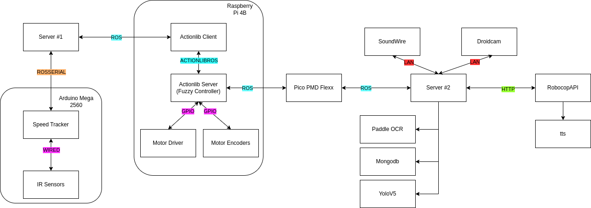
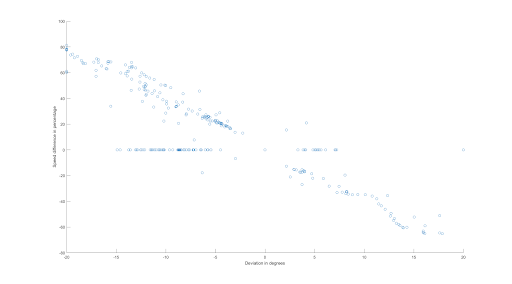

<p align="center">
  
</p>

--------------------------------------------------------------------

# Robocop

This project is aimed at developing an autonomous rover equipped with sirens, speakers,
and cameras to monitor traffic violations and enforce traffic rules. The rover communicates with a speed tracker
to detect speeding cars and automatically follow them until they stop. The rover (robocop) is also able to capture
the speeding car's license plate and fetch the driver's information.

## Installation & How to run it

```bash
git clone https://github.com/Charbel199/gm-robot-arm.git
```

The **/ml** and **/robocop_api** codes should run on a local machine.
The **/speed_tracker** code should run on an arduino. And the **/rover** code should run on the robocop's pi.

### Yolov5 model:

```bash
cd ml
python3 -m pip install -r requirements.txt
python3 detect_video.py
```


### Robocop API

```bash
cd robocop_api
docker build . -t robocop_api -f ./docker/Dockerfile 
docker run -p 6300:6300 robocop_api
```

### Rover code on Pi

Building the docker image on the pi:

```bash
cd rover
docker build -t robocop .
```


Setting ROS_IP automatically to communicate with other devices:
```bash
export ROS_IP=$(hostname -I | awk '{print $1}')
```

Running the image:
```bash
docker-compose up -d
```

Launching the server:
```bash
docker exec -it robocop bash
roslaunch speed_tracker speed_tracker.launch
```

On a separate terminal, to run the detection node:
```bash
docker exec -it robocop bash
rosrun speed_tracker detect_video_pmd.py
```

### Speec tracker code on arduino

To setup the Arduino (on the laptop where arduino is plugged in):
```bash
sudo apt-get install ros-${ROS_DISTRO}-rosserial-arduino
sudo apt-get install ros-${ROS_DISTRO}-rosserial
cd <path_to_arduino_libraries>
rosrun rosserial_arduino make_libraries.py .
```

To run Arduino speed tracker node:
Upload arduino code in robocop/speed_tracker/speed_tracker_infrared.ino to the arduino
```bash
rosrun rosserial_python serial_node.py /dev/ttyACM0 _baud:=57600
```

Finally, to enable override (can be run on any machine within the ROS network:
```bash
rosparam set /robo_cop/override 1
```


## General architecture

For the general architecture of robocop, we make use of 4 main devices:
- Arduino Mega 2560
- Server 1 (Personal Computer running Ubuntu 20.04)
- Raspberry Pi 4B (Running Raspberry Pi OS)
- Server 2 (Personal Computer running Ubuntu 20.04)




To implement the aforementioned steps in the introduction, the system follows a  complicated process. First, the speed tracker, implemented on Arduino Mega 2560 makes use of 2 infrared sensors to calculate the speed of any sufficiently close passing object.
It communicates this speed to Server 1, which then passes the information to the master processor: Raspberry Pi.
The Pi then verifies if the speed exceeds a certain predetermined threshold, and if so starts executing the chase sequence.
To do so, it first obtains the bounding box of the fugitive detected by our trained machine learning model which is using the video feed provided by DroidCam on one of our android phones installed in the rover.
The coordinates of this bounding box are then used by the PMD camera node to calculate the distance and deviation of the fugitive.
The values are then inputted to a fuzzy logic controller, which calculates target output speeds for the right and left motors of the rover.
The speeds are then provided to the motor through the Pi’s GPIOs using PWM.


This is maintained until robocop notices that the fugitive has stopped moving for a while, indicating the termination of the chase.
During this chase sequence, there is an OCR model attempting to detect the license plate of the fugitive. The model only attempts inference if the fugitive is sufficiently close (less than 50cm) and will only do it once.
After obtaining the license plate of the fugitive, the plate is fuzzily matched to a MongoDB database of registered vehicles.
Once the name of the fugitive is known, RoboCop will yell at them to stop escaping (by name). This is done through a text-to-speech model by Eleven Labs trained to mimic Dr. Noel’s voice.
To output the audio, we use SoundWire to use the phone’s speaker as an audio output device.
Note that the entire software on the Pi runs on a Docker container to allow for easy integration on any Pi. This also ensures that the Pi has all required libraries to run even after a format or change of SD card.
In all, RoboCop’s architecture is very intricate and integrates numerous technologies and tools.

## Fuzzy Control

The nature of our system required as an input the location of the fugitive rover, which could assume a very wide range of positions or orientations. This uncertainty in the input values made Fuzzy Logic a perfect candidate for our motor controller. The process of designing the Fuzzy Logic Controller consisted of several steps:

1- Specifying inputs and outputs:
    
This part was more or less clear from the beginning since the inputs to the system had to be the distance and deviation of the fugitive rover. During development, we decided not to include the current motor speeds as inputs since they would be redundant. The distance to the chased car was enough to decide whether to speed up our rover or slow it down.
The output of the controller was the duty cycle to be applied to the motors, since the latter were controlled by PWM. The output was split into two to separate the left pair of motors from the right pair.
Both inputs and outputs were chosen as triangular membership functions (MFs).

2- Defining the universes of discourse:
   - Distance: [0m, 2m]. Two meters was more than enough distance for the rover to catch up to. Any distance detected above 2m would fall in the last membership function.
   - Deviation: [-20°, 20°]. Assuming the fugitive is not escaping in U-turns, and given the limited range that the cameras could observe, 20° was the maximum a deviation could be observed on either side.
Output Speed: [0, 50]. Upon testing, it was apparent that due to power limits, a duty cycle of 50% was the maximum that the motors could receive without stalling. Thus, the maximum output was considered as 50%, which is the fastest a motor will be spinning.

3- Choosing Inference System Type:
    
We opted with using the Mamdani Fuzzy Inference System since our system outputs were better off being estimated and belonging to membership functions than being calculated by a crisp function.

4- Setting the Fuzzy Rules:
    
To ensure a variety in the output results, a total of 7 MFs were assigned to each of the inputs and outputs. Our system used conjunctive antecedents and a disjunctive set of rules. To better visualize the fuzzy rules, we filled out a Fuzzy Associative Matrix (FAM) and evaluated case by case what the motor outputs should be.
    

The FAM below describes the output of the left motors. The output of the right motors followed the same rules but inverted from bottom to top.


- As reference, we started with the middle row of the matrix where deviation is zero (blue shade). The motor duty cycle outputs were set to increase with the increasing distance. At some point when distance exceeds 1m, the motors were set to “Very Fast” to allow the rover to catch up to the fugitive.
- At an extreme deviation (red shade), the outputs of each pair of motors were set to the extremums of their universe of discourse in order to account for sharp turns. However, if the distance is far, the turn must not be so abrupt to avoid slowing down the rover, so the gap was made smaller.
- The middle areas (yellow and orange shades) were designed to be a middle ground between zero deviation and extreme deviation, so that the rover rotates fast enough to center the fugitive but not so fast as to disrupt the chase.
- These specific rules were the final result of simulated as well as actual test cases, until reaching a point where the chasing process was not only fast but also very fluid. 


5- Defuzzification:

Upon simulating the output results of the Fuzzy rules, we realized that minimum of maximum or maximum of maximum methods were not always as accurate as we needed, especially since the membership functions are triangular. Thus, the centroid method was chosen to be the defuzzification method.

## Car detection

### Fugitive Detection Model

The fugitive detection AI model was transfer trained from YOLOv5 using a custom dataset taken by our phone camera and augmented with Roboflow. The machine learning framework used was PyTorch.

### Acquiring a dataset

For the dataset, we took images of the RC car all around the LAU lounge using one of our phones. The images were as varied as possible, varying with distance, deviation, and rotation of the RC car. We took about 200 images by hand, which is not enough to train a CNN as large as YOLOv5 (even if we’re only transfer learning), which is why we used data augmentation.

### Augmentation

Roboflow is a powerful tool that allows us to easily augment our image dataset by applying multiple transformations to our images. This gives our dataset much more diversity, which is extremely important for deep learning models, as it helps prevent overfitting and improves generalization. 
In our case, we used our dataset of 200 images to create around 1000 new images. We applied a variety of transformations to our images, such as rotating, flipping, zooming, mosaic (cutting input image into four quadrants and randomly selecting three other images and pasting them into the quadrants), and changing brightness and contrast. We also used Roboflow to apply different filters to our images, such as blur and sharpen, to further increase the diversity of our dataset.


### Transfer Learning Training

Transfer learning is a technique used in deep learning where a pre-trained model is used as a starting point for a new task. In the context of object detection, transfer learning is used to quickly and accurately train a model on a new dataset with limited examples.

Here are the steps we took to train the model to detect only our RC car:

1- Download a pre-trained YOLOv5 checkpoint. For this step we used the YOLOV5L (large) checkpoint.

2- Load the pre-trained checkpoint into the YOLOV5 model.

3- Replace the final layer of the YOLOV5 model with a new layer that has only 1 class.

4- Freeze the weights of all layers except the final layer.

5- Train the model on our own dataset augmented and labeled through Roboflow using fine-tuning technique with a batch size of 8 and 50 epochs.

6- Evaluate the model on a validation set to check its performance.


### Camera Calibration and Interpolation

With the detection model ready, we need a way to extract the distance and deviation of the fugitive. To do so, we make use of another camera, a PMD Pico flexx, a camera with time of flight sensors that returns x, y, and z values of every pixel in its field of view. 

However, this camera does not return any RGB images, and we cannot use the detection model developed earlier on it. 

To solve this issue, we combine two cameras, the phone’s camera to find the bounding box of the fugitive, then the PMD camera to find the distance and deviation of it.

Since the two cameras do not have the same intrinsic and extrinsic parameters and are not placed on the same point, it is quite difficult to map a bounding box on one camera to the other. Therefore, we make use of a process called camera calibration and triangulation to find the position of a pixel on one camera on the other camera. 

**Intrinsic properties:**
- Focal length
- Lens Distortion
**Extrinsic properties:**
- Camera position
- Orientation in 3D space

By placing the two cameras close to each other, we try to unify the extrinsic properties of the two cameras as much as possible, with only a slight horizontal bias between the two. However, the intrinsic properties cannot be modified, which is why we perform interpolation: 


As we can see in the above image, the bounding box position cannot be directly mapped onto the PMD camera. For interpolation, we shift the original bounding box (red) to another position (green) based on its position on the screen. 

Examples:
- Left of the screen: almost 1-1 mapping, with small positive y-offset.
- Middle of the screen: small positive x and y-offset.
- Right of the screen: large positive x-offset and slight positive y-offset.

In general, y must always be slightly positively offset, while x offset will increase based on how far to the right of the screen the bounding box is. This is due to the lens distortion and since the PMD camera is placed to the left of the phone camera:

### Time-of-flight Sensor

With the calibration step complete, we can now make use of the time of flight sensor to obtain the fugitive’s distance and deviation. 


To solve this, we use the following strategies. 

**Distance:**
- Find the bounding box containing the RC car and obtain all z values of the pixels inside of it.
- Filter the pixels based on confidence, taking only the pixels with a confidence > 50%.
- Discard pixels with a distance of 0.
- Create a histogram of 15 bins, with values ranging from 0 to 5 meters.
- Select the bin with the most pixels as the fugitive.
- Calculate the mean of distance (z) of these pixels.

**Deviation:**
- Find the bounding box containing the RC car.
- Create a new bounding box (cyan in Fig. x) that has 60% the width of the bounding box and the same center and obtain all x values of the pixels inside of it.
- Filter the pixels based on confidence, taking only the pixels with a confidence > 50%.
- Create a histogram of 15 bins, with values ranging from -1 to 1 meters.
- Select the bin with the most pixels as the fugitive. 
- Calculate the mean of horizontal offset (x) of these pixels.
- Find the deviation angle of the fugitive by calculating the inverse tangent of horizontal offset divided by distance. 


### Optical Character Recognition Model

For the optical character recognition model, we make use of the well-known PaddleOCR system. 

However, for this model to function properly, we need a clear image of the fugitive's license plate. To ensure this, we only send an image to be processed by the OCR engine if the fugitive is within 50 cm of RoboCop, we also only run the OCR once every 10 seconds until the plate is found because of how resource consuming it is. Running it every frame would reduce our detection FPS from 50-70 to a mere 4-5. After recognizing a string, we run it through a RegEx expression to strip it from some unneeded characters (we only keep alphanumeric characters).

## Text-to-speech System 

For the voice of RoboCop, we made use of Eleven Labs’ Prime Voice AI, advertised as “the most realistic and versatile AI speech software, ever.”. We make use of their voice cloning function to train their AI model on a custom voice of our choice. 

To do so, we downloaded some of Dr. Noel Maalouf’s lecture recordings, transformed them to audio using ff-mpeg, and trained Prime Voice AI on these audio. With that, we had our own AI model that can read any text in Dr. Noel’s voice.

We then used our own API key to send HTTP requests to Eleven Lab’s endpoint with any input text that we wished to use. We made use of the fugitive’s name fetched from the ALPR system to call them out by name. E.g.: “Charbel Bou Maroun, this is the police, pull over immediately…”

The audio is then played on the phone inside the RoboCop chassis using SoundWire.

## Speed tracker

For the speed tracker “radar”, we used an Arduino Mega 2560 and two infrared sensors. The implementation is simple:


## Simulation

Before commencing the full implementation of RoboCop, we wanted to simulate the fuzzy logic controller and adjust it according to the results. To do so, we opted to use Unity. With Unity’s built-in NVIDIA PyhsX physics engine, we could implement vehicles with actual wheels and vehicle simulation with friction in mind.


## Main container

The rover’s main container consisted of two parts:

- A bottom hollow part designed to fit perfectly on top of the Rover 5 to obtain a strong grip on it, while being empty in the middle to pass the wires to the upper part.


- An upper part serving as the actual container:
    - It was divided into sections by internal barriers, where each section was measured to fit the component to be placed in it.
    - A section of the floor was left hollow to pass the wires from the bottom part.
    - An opening was created in the front of the container to place the Pico Flexx camera firmly.
    - Due to the physical limits of our 3D printer, the total width and depth of the container could reach up to 20 cm only, so adjustments had to be made to fit components on top of eachother.
    


- To avoid overcomplicating the 3D model, the phone holder was designed as its own separate model. Dimensions of the mobile phone to be inserted were taken, and a holder was modeled to slot it in an out. Two edge clips forming 90° were attached to the phone holder to ensure it holds tightly to the modeled container.


## Graphs
### Fuzzy Control System
The fuzzy control system is represented by the below 3D mesh graphs:


As we can see, both motors behave in the same way relative to distance, meaning the speed increases the further the fugitive. However, we see an inverted behavior when it comes to deviation. This is expected as we want to rotate the rover when the fugitive escapes. Additionally, we see a sort of platform/plateau at higher distances, which is to be expected since the rules set the speed output to maximum when a certain distance threshold is exceeded.

### Chase Feedback

We then attempt to graph the feedback provided from the actionlib server during one of the chases. We obtain plots corresponding to distance, deviation, and the speeds of both motors as read by the encoders as a percentage.


Although the plots are all over the place, we can observe some results:

- Initially, when the distance and deviation is zero (car not yet detected), both motors are stationary
- Once the chase starts, we see a sudden burst in the motor speeds.
- Whenever the deviation is 0 or close to 0, we see that the two motors have similar speeds.
- At time step 350, we can see that the distance is quite high (2.5m) and the deviation is about -20°. The motor speeds corresponding to these inputs are reasonable, with the left motor having a low speed of about 30% and the right motor a high speed of about 90%. This should allow RoboCop to properly adjust its turn angle to follow the fugitive.

To more properly evaluate the chase system, we derive two new plots:




The first plot shows us how the robot’s speed as a magnitude increases as distance increases (as expected). Magnitude denotes the average of the two motor speeds here.

The second plot shows us how the difference in motor speed (percentage) changes with respect to the deviation. This is also expected as this difference is what allows RoboCop to rotate and follow the fugitive correctly.

Lastly, we note some outliers or errors, for example we see that sometimes RoboCop is rotating in the wrong direction or is speeding up too much when the distance is low. We attribute these outliers to erroneous encoder readings.

## Video

A video demonstrating RoboCop is found on [YouTube](https://youtu.be/BHR8bPCHYos).

## Developers

- [Georges Daou](https://github.com/George1044)
- [Charbel Bou Maroun](https://github.com/Charbel199)
- [Khaled Jalloul](https://github.com/khaledjalloul)

## License
This project is licensed under the MIT License. See the LICENSE file for details.